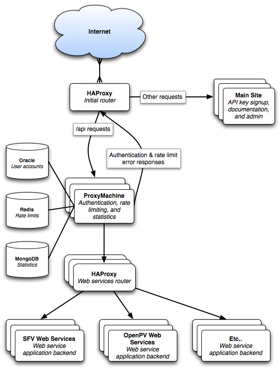

# developer.nrel.gov Architecture Overview

## The Big Picture

## Design Goals

The architecture is designed to allow for any number of independent web service backend applications to co-exist under a single framework. Common functions, such as authentication against a single user database, rate limiting, and statistics can all be provided by the framework in a uniform way. This frees each invididual web service backend application from implementing the same logic. This also allows for the individual web service backend applications to exist on different servers, be written in different programming languages, or vary in any other way.

## A day in the life of an incoming request

But what does that spaghetti of a diagram mean? That's probably best explained by stepping through how a request is handled.

1. A request is sent from a client to http://developer.nrel.gov
2. Our first HAProxy server, "Initial router," receives the request on port 80.
3. The initial router decides how to handle the request.
   1. Any request starting with `/api` will routed to our ProxyMachine server. [Follow this path!](#main_site_requests)
   2. All other requests (for example, `/`, `/account/new`, `/docs`) will be sent to our "Main Site" Ruby on Rails application. [Follow this path!](#api_requests)

<a id="main_site_requests" />
### Main Site requests

All non API requests coming to developer.nrel.gov are simply handed off to our "Main Site" Ruby on Rails application. This application handles all of the public facing content that appears to users when they go to developer.nrel.gov in their browser. This includes:

* Our home page
* API key signup
* API documentation and navigation
* A separate, private administrative application for us to perform tasks.

<a id="api_requests" />
### /api requests

#### ProxyMachine - Authentication, rate limiting, and statistics

API requests fall deeper down the rabbit hole. After the initial HAProxy router identifies a /api request, the request gets passed onto our authentication ProxyMachine server. This authentication proxy acts as a gatekeeper, performing several tasks:

1. The GET parameter `api_key` is extracted from the request and validated against the user accounts and roles in our Oracle database.
2. Requests from the same API key are rate limited using a Redis database. [Why Redis for rate limiting?](#why_redis)
3. Statistics are gathered for the request and inserted into the MongoDB database. [Why MongoDB for statistics?](#why_mongodb)

If authentication or rate limiting fail, the request ends and ProxyMachine sends back an appropriate HTTP error status code and error message in the body. The error message body is returned in format matching the request format. For example, an error occurring on `/api/fuel_stations.xml` will return an XML error message, while `/api/fuel_stations.json` will return an JSON error message. If no format can be detected, XML error messages are the default.

If authentication and rate limiting succeed, ProxyMachine returns nothing, but instead passes the request onto our second HAProxy server, the "Web Services Router".

By performing these common tasks (authentication, rate limiting, and statistics) at this higher level, we can guarantee that all API requests are handled in the same fashion, errors will be returned in the same way, and the each web service application doesn't need to be concerned with handling these details.

#### HAProxy 2 - Web services router

If the client request has met all of ProxyMachine's requirements, it ends up at our second HAProxy server, the web services router. This server's job is to route API requests to the appropriate backend web services application. The routing is based on the request URL, so HAProxy is configured to identify certain URLs and map those to a specific web services backend. Supposing the client request was for `/api/fuel_stations/nearest.json`, HAProxy could be configured to route any requests beginning with `/api/fuel_stations` to our Sustainable Fuels & Vehicles web services application backend. At the same time, HAProxy could also be configured to route any requests beginning with `/api/openpv` to a separate OpenPV web services application.

The client request can also be modified by HAProxy at this stage. Modifications will typically involve changing the URL that the backend application sees. This allows for a different public URL structure than what the backend is configured to respond to. For example, a backend may be configured to respond to `/fuel_stations/nearest.json`, but the public URL is going to be `/api/fuel_stations/nearest.json`. HAProxy can be configured to strip the `/api` prefix before sending the request to the appropriate backend. Similarly, entire URLs could be changed, allowing a public URL like `/api/something.json` to be routed to the backend as `/web_services/transportation/trucks/something_else.json`.

If HAProxy is unable to find a matching URL and backend server, HAProxy will respond with an error code response.

#### Web service backends

After the HAProxy web services router determines the correct backend application to send the request to, the appropriate backend receives the client request. The backend server sees the request as a normal incoming request, handles the request, and sends the response back. The response makes its way back up through the chain of proxy servers, finally arriving back to the client.

## Notes

### Proxy request streaming

For performance reasons, it's important that the various proxy servers for API requests don't buffer incoming requests or outgoing responses. Instead, data should always be streamed in chunks as they are received. Both HAProxy and ProxyMachine behave this way by default. With our configuration, the HAProxy servers read the beginning of a request's headers to determine its URL. The ProxyMachine server reads a request's entire headers so it has access to various things (GET parameters supplying the `api_key`, IP address of the client, etc). However, beyoyond reading those limited headers, none of the proxy servers ever read the entire request or the request body.

If changes are introduced to the proxy server framework, it's important to understand this and not introduce any complexity that relies on reading a request's body or buffering the entire request.

To illustrate a bad scenario, imagine a web service that requires uploading a 100MB file and returns 200MB of raw data in response. If each proxy between the client and backend application server buffered the entire request and response, there would be significant overhead and delays with each proxy server encountered. As currently designed, the proxies may read some of the headers for incoming requests, but after that, the request body is streamed to the next server as the request is still being received. The final server's response will also be streamed back to the client, with each proxy in between passing along data as soon as it's received.

### Scalability

One side effect of this architecture is its theoretical scalability. As depicted in the diagram, everything except the initial HAProxy server can exist in clusters. All of our routing is handled through HAProxy which we've configured to treat each backend as a server farm. Right now, our server farms might only be one server, but more servers could be added to a farm, and then HAProxy can load balance requests through all available servers.

<a id="why_redis" />
### Why Redis for rate limiting?

[Redis](http://code.google.com/p/redis/) is a blazingly fast key value store. To rate limit an API key, we simply add a value for each request's API key and the hour it was accessed. Redis supports atomically incrementing values, so we can easily increment this counter for each request that comes in from the same API key within the same hour. We can follow a similar pattern for each API key's requests in a single day, and use these counters to quickly see if an API key is over any hourly or daily rate limits.

Redis also easily integrates with the existing [Rack::Throtle](http://github.com/datagraph/rack-throttle) project. We can use this rack middleware inside our ProxyMachine server to simplify the rate limiting logic.

Redis persists data to disk, however the entire database must fit into memory. So while it isn't suitable for storing large amounts of data forever, it's well suited for this application, where old data can be removed after a day. 

<a id="why_mongodb" />
### Why MongoDB for statistics?

[MongoDB](http://www.mongodb.org/) is a database system that has a couple of features that make it well suited for logging statistics. Like Redis, it supports atomic increment operations on counters, making it easy to keep counters of the things we care about. It doesn't match Redis's speed as a pure key-value store, but it's still plenty fast and supports asynchronous update/insert calls. This actually makes it even better suited for logging, since we can send data to MongoDB to log, but we don't have to wait for it to actually write the data to the database or return a result. This keeps the overhead of gathering statistics to a bare minimum. Also, unlike Redis, the entire database doesn't have to be stored in memory, so it can easily handle long-term storage and archiving of statistics.
