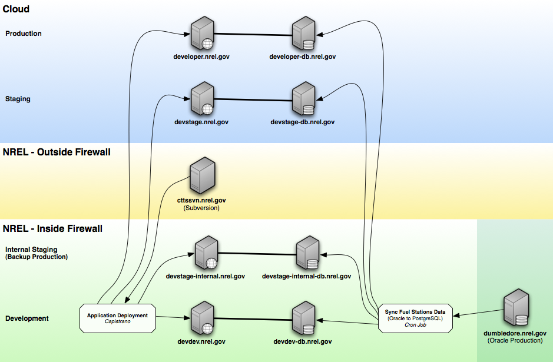
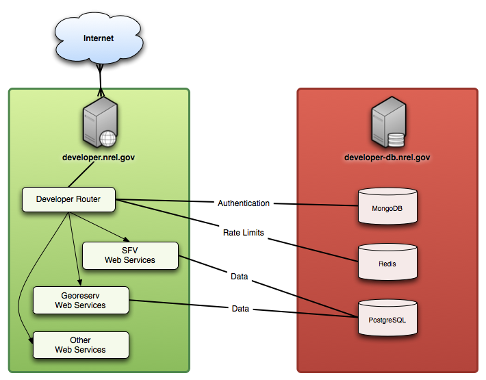

# developer.nrel.gov Network & Servers Architecture

## Servers & Environments

For each environment, we have an application and database server. The production servers and the stating servers are hosted on the cloud. The backup production servers and our development servers are hosted inside the NREL network.

## Server Roles

The application server houses our router and the individual web service applications. 

The database server houses our various databases that get used by the router and web services applications.

For more details on how the router works, and the underlying technology, see the documentation on {file:docs/ArchitectureSoftware.md software architecture}.

## Flexibility

This is how the servers are setup now, but it's designed to be scalable and flexible. If ever desired, the router could be hosted on separate server, while the individual applications could be split up and load balanced in any configuration. Additional database servers could be added, and so on.
