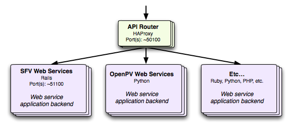

# How-to: Add a new web service application backend

In the {file:docs/ArchitectureSoftware.md software architecture}, the web services are implemented inside any number of independent application backends. These backend applications can be written in any programming language and can be configured to respond to any number of arbitrary incoming URLs. When an entirely new backend application is being added to the developer.nrel.gov system, it must first be configured within the system so requests can be routed to it.

*Note:* If a backend application has already been configured (that is, any http://developer.nrel.gov/api requests are already being routed to it), then theses steps have already been followed. In that case, you're probably interested in {file:docs/HowToConfigureUrlEndpoints.md adding additional URL endpoints to an existing web service application backend}.

From the overall architecture diagram, we're only configuring the bottom of the stack:

The web services router takes in requests after they've been authenticated, and then decides which backend application to pass the request to. Through these steps, we're simply configuring the HAProxy web services router so it knows how to find a specific web services application backend.

## Decide where the web service will be hosted {#hosting}

You have two options on where your web service may actually live:

* [Locally](#hosting_locally): The web service will be hosted and served alongside other services on developer.nrel.gov.
* [Externally](#hosting_externally): The web service may exist on any other server.

While hosting locally with other developer.nrel.gov services takes a little leg

### Hosting locally on developer.nrel.gov {#hosting_locally}

1. **Add Your Code**

    Inside your own sandbox of the `developer_apps` project on devdev.nrel.gov (for example, `/srv/developer/devdev/sandboxes/nmuerdter/developer_apps/current`), add your services code as a new directory inside the `apis` directory.

2. **Configure your application's hosting**

    On the developer server's we're using nginx as the default web server. Nginx should be able to handle PHP, Ruby, Python, and Perl services (probably others too). We're also running Tomcat for Java-based services. Depending on the application server to be used, your configuration will vary.

    Other hosting solutions should technically be possible, but aren't currently supported. Let's talk if you need something else.

    * **nginx**

      Inside the `developer_apps` project, create a new templated nginx configuration file for your application inside `config/nginx/apis`. All nginx configuration files inside `config/nginx/apis` will automatically get included by nginx.

      For example, here's the configuration for a rails-based project in `config/nginx/apis/sfv.conf.erb`:

          #
          # apis/sfv - Sustainable Fuels & Vehicles rails web services.
          #
          server {
            listen 51100;
            server_name <%= domain %>;

            root <%= current_path %>/apis/sfv/public;

            access_log <%= shared_path %>/apis/sfv/log/access.log combined;
            error_log <%= shared_path %>/apis/sfv/log/error.log;

            # Serve this rails site with Passenger.
            passenger_enabled on;
            passenger_base_uri /;

            # Set the current environment.
            rails_env <%= rails_env %>;
          }

          # Pre-start the rails app.
          passenger_pre_start http://<%= domain %>:51100/;

      **Note:** These configuration files are embedded ruby (ERB) template files. Anything in between <%= => gets substituted for a variable's value during Capistrano deployment. This allows our deployment scripts to automatically set up completely separate sandboxes in the development environment.

      **Important:** Each new service is configured in nginx to listen on a unique port (in the above example, port 51100). This is done so the API Router can easily target this web service. When setting up a new host for your service, you must pick a new, **unique** port. The standard we're using is that everything within the `developer_apps` project uses ports in the 51000+ range. We then give each application a buffer of 100 ports to allow for potential scaling while keeping a service's ports all together (100 ports is definitely overkill, but it's easy and gives us ample room).

      To find a new port for your application, you first need to see what ports are currently being used by other API applications. You could go through the configuration files, or run this command on the command line to do the searching for you:

          rake nginx_ports

      Currently, I get this output:

          nginx ports being used by `developer_apps`:
          51000, 51100, 51200

      The next logical starting port I'd use for a new host is 51300. If that was already being used, then it would be 51400, and so on.

      Whatever port you settle on, keep it mind and make sure your nginx configuration file is configured to listen on that port.

    * **Tomcat**

      TODO

3. **Perform any additional deployment configuration in Capistrano**

    Depending on the type of your application, additional tasks may need to be performed during deployment. Any additional tasks can be added to Capistrano's deployment scripts at `config/deploy.rb`.

    For example, Rails applications typically have a variety of tasks to perform upon deployments. All of that is encapsulated by our custom recipes, so adding a new Rails application is just a matter of adding it to the list of Rails applications in `config/deploy.rb`

       # Define the rails-based applications.
       set :rails_applications, [
         "public_site",
         "apis/sfv",
         "apis/fleet_atlas",
       ]

4. **Commit and redeploy your `developer_apps` sandbox**

    With your application now configured inside your `developer_apps` sandbox, you should commit your changes to subversion.
    
    Next, you'll need to bring your new nginx server up and running. The easiest way to do this (since the template configuration file needs to be parsed) is to redeploy your sandbox after committing everything:

      cap development deploy SANDBOX=your_sandbox_name

    After that finishes, you should be able to surf to http://your_sandbox_name.devdev.nrel.gov:your_server_port/ and get direct access to your services. For example, http://nmuerdter.devdev.nrel.gov:51100/ gives me direct access to my sandbox's SFV web services.

### Hosting externally {#hosting_externally}

If your web service is already successfully running on an external server, simply ensure it can be accessed from the developer.nrel.gov and devdev.nrel.gov servers. You may also consider setting up restrictions so that your web services are only accessible by the developer servers (otherwise, if someone discovers your backend web services box, they'll be able to access it without authentication or rate limits).

Also keep in mind that while hosting externally, your individual web service will not be on the cloud, and it will not be sandboxed for individual developers (each developer's sandbox will point to your single instance of the external web service).

## Configure API Router {#api_router}

Regardless of how your hosting the web service (locally or externally), you'll need to configure the API Router so it knows which services to route to your application and how to find it.

In the copy of the `developer_router` project on devdev.nrel.gov (`/srv/developer/devdev/developer_router/current`), follow these steps:

1. **Add a new backend configuration for your application**

    Create a new HAProxy backend configuration file at `config/backends/api_APPLICATION_NAME_farm.cfg.erb` to define your application's backend servers. For example, here's `config/backends/api_sfv_farm.cfg:

       # Sustainable Fuels & Vehicles API Services Backend
       backend api_sfv_farm
         # Strip /api from the beginning of the request URL before the receiving
         # backend application sees the request.
         #
         # Turns a request from "GET /api/fuel_stations" to "GET /fuel_stations"
         reqirep ^([^\ ]*)\ /api(/.*) \1\ \2

         balance roundrobin
         server api_sfv1 127.0.0.1:51100

    To add load balancing, it's just a matter of listing any additional servers to load balance to in this configuration file.

2. **Create a new router matches file**

    Create a new file to determine which URL endpoints get routed to your application at `config/haproxy/api_router_matches/api_APPLICATION_NAME.lst` This file's contents should list the relative URL paths that should be routed to your application. For example, `config/haproxy/api_router_matches/api_sfv.lst` might list:
    
       /api/fuel_stations
       /api/transportation_laws

    That would direct any requests beginning with `/api/fuel_stations` and `/api/transportation_laws` to the SFV application. For more details see the page on {file:HowToConfigureUrlEndpoints.md configuring URL endpoints}.

3. **Configure the API Router for your application**

    Next, you need to update API Router's configuration to route any requests matching URLs in the new `config/haproxy/api_router_matches/api_APPLICATION_NAME.lst` file to your application.

    Add the following lines for your application to the `config/haproxy/frontends/api_router.cfg.erb` to configure the API Router to use the new .lst file to route tor your backend:

       # Your Application's Name
       acl url_match_api_APPLICATION_NAME path_beg -i -f <%= File.join(latest_release, "config/haproxy/api_router_matches/api_APPLICATION_NAME.lst") %>
       use_backend api_APPLICATION_NAME_farm if url_match_api_APPLICATION_NAME

4. **Commit and redeploy `developer_router`**

    With your application now configured inside the API router, add the new files you created to subversion and commit all your changes.
    
    Next, redeploy the `developer_router` project to parse any of the updated configuration files and reload HAProxy with the changes:

       cap development deploy

    After that finishes, you should be able to surf to http://your_sandbox_name.devdev.nrel.gov/api/your_new_service. Without an API key, you should be rejected by default. Supply http://your_sandbox_name.devdev.nrel.gov/api/your_new_service?api_key=DEMO_KEY and you should get access. Rejoice in the developer.nrel.gov platform (hopefully) working.
