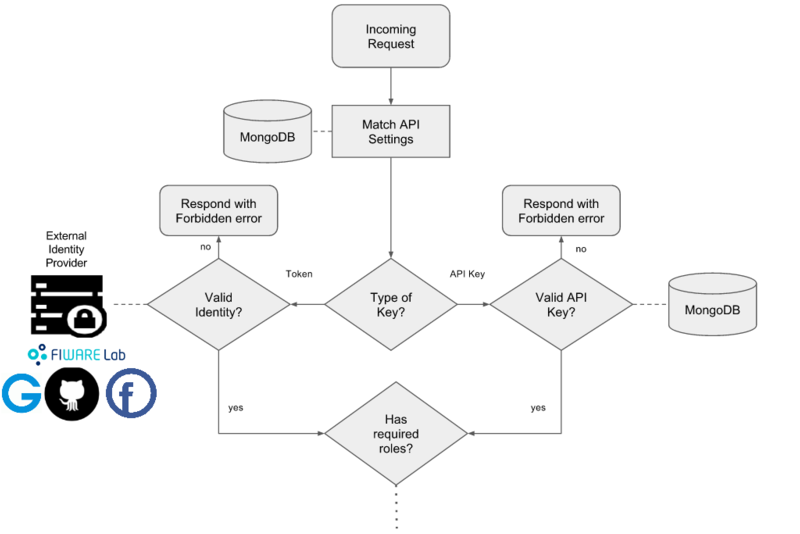
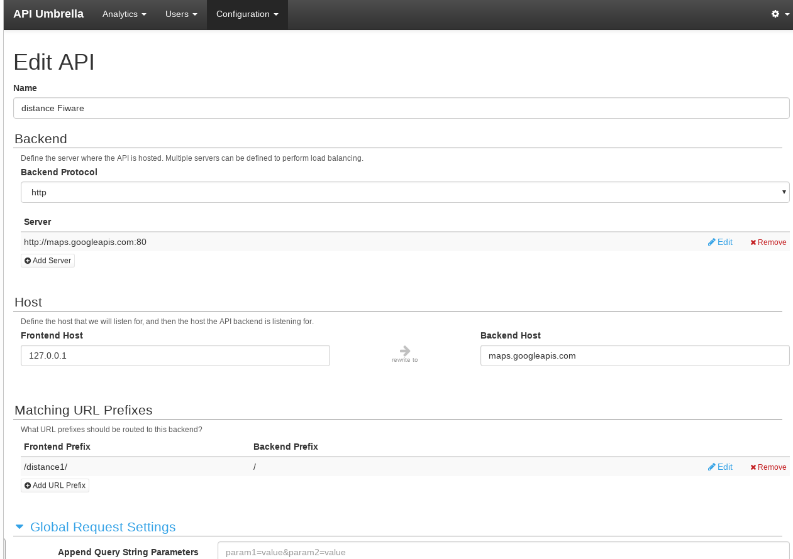
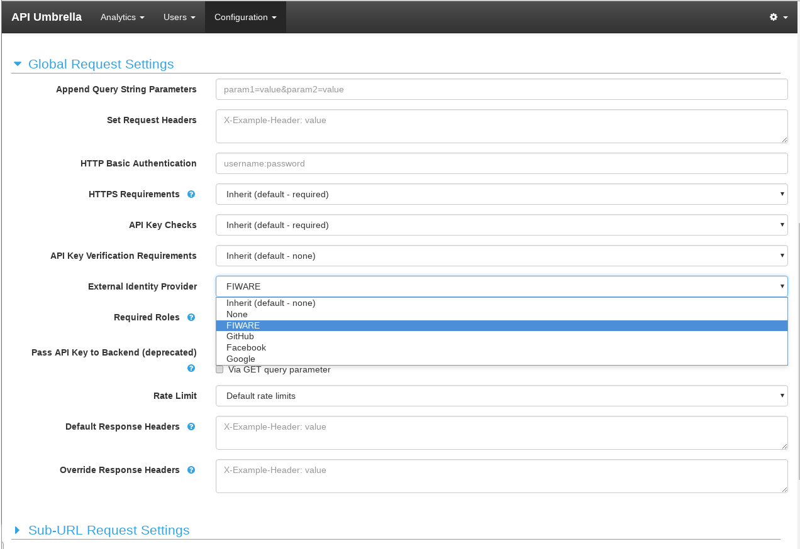

## External IdP Validation

This new feature allows to the API-umbrella users
the possibility of make request to a registered API
 backend, using an API key or an OAuth2 token. 
 If the user uses a token in the request, this token is verified using an external IdP, once the token is validated the user information is retrieved and redirect to the API backend following the usual workflow. 
 The list of IdP's 
 included in this development are: 

* Fiware 
* Google
* Facebook
* GitHub

Hence, after the inclusion of this feature,
the gatekeeper architecture is modified 
as is showed in the next figure:  



## Getting Started

### Installation
For using API-Umbrella with External IdP validation, you have to clone 
this repo and install API-Umbrella from source code. The instructions fordoing this are:

Note: This installation was tested with centos 6 and 7 with other Linux
distribution should work too but, is recommended to use centos 

First, clone the repo and install:

```
$ git clone https://github.com/ging/api-umbrella.git
$ chmod 775 -R ./api-umbrella
$ cd api-umbrella
$ sudo ./build/scripts/install_build_dependencies
$ ./configure
$ make
$ sudo make install
``` 
This process could take some minutes while it download and install the dependencies.

Second, start API-Umbrella

```
sudo /etc/init.d/api-umbrella start
```
### Docker API-Umbrella

Also, you have the option of use a docker container instead of install
API-Umbrella. The instructions for creating and running the docker 
container with this version of API umbrella are:

You can run directly the container pulling the image from the docker hub:

```
$ docker run -d --name=api-umbrella -p 80:80 -p 443:443 martel/api-umbrella
```

Or build the API-Umbrella  image and run the container:

```
$ git clone https://github.com/ging/api-umbrella.git
$ cd api-umbrella/docker-ging
$ docker build -t umbrella:0.14.4 .
```

Once you have your api-umbrella image, you can run the container and use it

```
$ docker run -d --name=api-umbrella -p 80:80 -p 443:443 umbrella:0.14.4
```

### Admin and User guide

At this point, you can perform the same operations described in 
[getting started](https://api-umbrella.readthedocs.org/en/latest/getting-started.html). but Also
in this section is included the guide of how to create API backends for processing 
the requests using Oauth2 token and external IdP's

#### Registering and API-Backend uding API REST 

The procedure of how you can create a request using an REST call is available in the official documentation but,
for using the external validation feature you need to include in you JSON body request the field ** require_idp:<IdP-value> ** where IdP value could be one of this: fiware-oauth2, google-oauth2, facebook-oauth2, github-oauth2.

An request example for registring a API-backend with a generic parameters is:

```
curl -k -X POST "https://<your-api-umbrella-hostaname>/api-umbrella/v1/apis" -H "X-Api-Key: <your-API-KEY>" -H "X-Admin-Auth-Token: <your-admin-auth-token>" -H "Accept: application/json" -H "Content-Type: application/json" -d @- <<EOF
{
  "api": {
    "name": "distance FIWARE REST",
    "sort_order": 100000,
    "backend_protocol": "http",
    "frontend_host": "127.0.0.1",
    "backend_host": "maps.googleapis.com",
    "servers": [
      {
        "host": "maps.googleapis.com",
        "port": 80
      }
    ],
    "url_matches": [
      {
        "frontend_prefix": "/distance2/",
        "backend_prefix": "/"
      }
    ],
    "balance_algorithm": "least_conn",
    "settings": {
      "require_https":"required_return_error",
      "require_idp": "fiware-oauth2",
      "disable_api_key":"false",
      "api_key_verification_level":"none",
      "rate_limit_mode":"unlimited",
      "error_templates": {},
      "error_data": {}
    }   
  }
}
EOF
``` 

In the current example we create an API-BAckend that use the google maps library for retreaving the distance between two points. This backend  was configure for making the token validation with the Fiware external IdP.

The output, should return the JSON with the parameters that you sent  

#### Registering and API-Backend
The next figures show the Web UI for creating an API backend. You need to
 fill the fields  for registering you API but, for choosing
the external IdP in order to validate the user's token you have to go to
the **Global request setting** dropdown, in that part of the page, you have to choose
between the available IdP's in the option **External Identity Provider**
. Once you were selected the IdP, you need to save the backend and publish it




#### Making requests to your API's

For making requests to your API's with the external IdP validation 
you need to send the Oauth2 user token by param or header.

Sending the token by param:
```
curl -k "https://<your-api-umbrella-hostname>/<your-api-query>?token=<your-token>"

```
An example of using the google maps API backend registered in API-Umbrella:

```
curl -k "https://127.0.0.1/distance1/maps/api/distancematrix/json?units=imperial&origins=Washington,DC&destinations=New+York+City,NY&token=XXXXXXXXXX"
``` 
Output:
``` 
{
   "destination_addresses" : [ "New York, NY, USA" ],
   "origin_addresses" : [ "Washington, DC, USA" ],
   "rows" : [
      {
         "elements" : [
            {
               "distance" : {
                  "text" : "225 mi",
                  "value" : 361940
               },
               "duration" : {
                  "text" : "3 hours 51 mins",
                  "value" : 13839
               },
               "status" : "OK"
            }
         ]
      }
   ],
   "status" : "OK"
}

``` 

For sending the token via header:

```
curl -k -H "X-Auth-Token:<your-token>" "https://<your-api-umbrella-hostname>/<your-query>"
```

An example using the same API backend of google maps.

```
curl -k -H "X-Auth-Token:XXXXXX" "https://127.0.0.1/distance/maps/api/distancematrix/json?units=imperial&origins=Washington,DC&destinations=New+York+City,NY"
```
Output:
``` 
{
   "destination_addresses" : [ "New York, NY, USA" ],
   "origin_addresses" : [ "Washington, DC, USA" ],
   "rows" : [
      {
         "elements" : [
            {
               "distance" : {
                  "text" : "225 mi",
                  "value" : 361940
               },
               "duration" : {
                  "text" : "3 hours 51 mins",
                  "value" : 13839
               },
               "status" : "OK"
            }
         ]
      }
   ],
   "status" : "OK"
}

``` 
For any additional questions or support please send an email to:

* <jamunoz@dit.upm.es>

